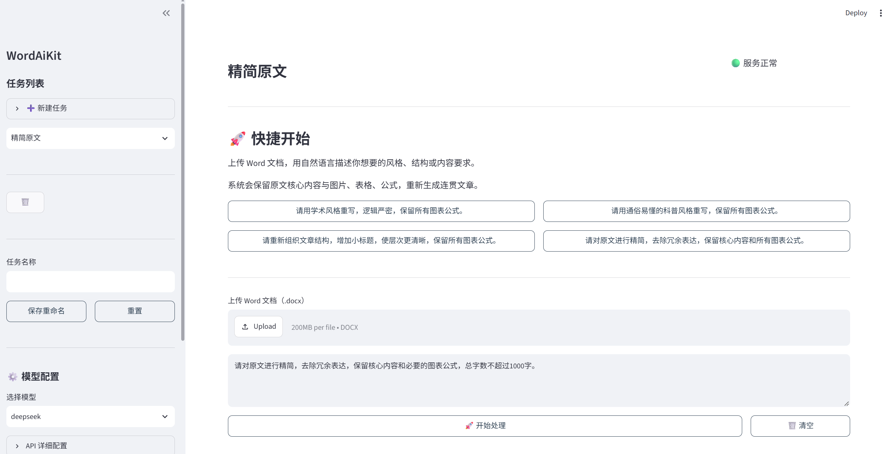

<h1 align="center">WordAiKit</h1>


WordAiKit是一个轻量级的Word文档智能处理工具，能够对 Word 文档(docx格式)进行文字润色、标题生成、风格改写等处理，同时可以保留原文中的图片、表格、公式等复杂元素。这个工具旨在帮助用户高效地处理自己的草稿、随笔等非正式文档，借助大模型能力让自己的随手一记变得更专业更规范，但又不会改变原文的核心内容。

<p align="center"></p>


## 更新

2026-9-26： V2.1.0
- 改用streamlit作为前端技术栈，前端界面更简洁美观，易用性好。
- 去掉了模板参考功能，弱化了系统提示词的约束，增强用户提示词灵活性。用户可以更自由地生成自己的文档，同时可以保留原文图表和公式。

2026-6-14: V2.0.0 
- 新增参考模板输出模式: 上传docx格式参考模板和需要整合的docx格式原始文档, WordAiKit可输出符合模板的最终文档
- 新增本地大模型接口: 支持ollama和LM Studio, 功能正在验证中
- 优化润色模式: 可选文章类型或自定义文章类型, WordAiKit润色文章时将适应相应的风格; 输入自定义提示词, WordAiKit将根据提示词进行修改和润色

2026-3-15：V1.0.0 (初始版本)
- 基础的智能文字润色和复杂元素(图 表 公式)保留功能

## 计划事项
- [ √ ] 优化前端, UI更简洁
- [ ] 验证本地模型接入的效果
- [ √ ] 进一步提升自定义指令编辑的精准性


## 主要亮点
- 复杂元素保留：在生成文档时，可以保留和引用原文档中的图片、表格、公式 
- 自定义提示词：用户可自行编写提示词，WordAiKit将根据提示词进行修改和润色
- 隐私保护: API KEY配置信息保存在本地非项目路径, 首次配置下次直接使用 
- 支持本地模型接入: ollama和LM Studio


## 安装与使用

### 基础环境要求

- Python (3.8~3.10) 
- 操作系统：Windows / Linux / macOS

使用前需要先下载WordAiKit项目，然后在项目目录下，根据你自己的电脑环境选择以下任意一种方式创建一个虚拟环境：conda或venv。

### 方式一：使用 Conda 创建虚拟环境

```bash
conda create -n wordaikit python=3.10

conda activate wordaikit
```

### 方式二：使用 venv创建虚拟环境

```bash
python -m venv .venv

# Windows系统激活虚拟环境:
.venv\Scripts\activate

# Linux/macOS系统激活虚拟环境:
source .venv/bin/activate
```

### 运行程序

```bash
python main.py
```

程序启动后会自动打开浏览器访问 <http://localhost:8501>

## 特别说明
- 出于安全考虑，云端API KEY配置信息保存在本地自定义的且非项目文件的路径。请勿泄露给他人。


### 获取 API Key

| 服务商      | 获取地址                                   |
| -------- | -------------------------------------- |
| DeepSeek | <https://platform.deepseek.com>        |
| 阿里云通义    | <https://dashscope.console.aliyun.com> |
| Kimi     | <https://platform.moonshot.cn>         |


## 许可与联系

- 许可证：MIT License
- 联系邮箱：bggcs111@163.com

